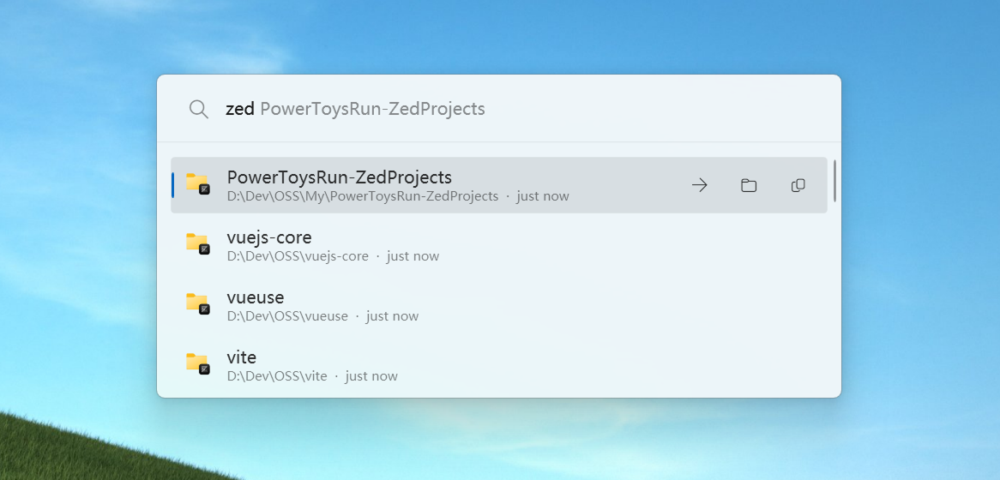

<p align="center">
  
</p>

<h1 align="center">Zed Projects</h1>

<p align="center"><sub>Open recent <a href="https://github.com/zed-industries/zed">Zed</a> projects from <a href="https://github.com/microsoft/PowerToys">PowerToys Run</a>.</sub></p>

<p align="center">
  <br>
  
  <br>
</p>

## ✨ Features

- Lists recent **local** Zed projects, newest first
- Fuzzy match on project name and full path (multiple words are ANDed)
- Shows the absolute path plus a relative last-opened time (e.g. "3 hours ago")
- `Enter` opens the project in a new Zed window
- Context menu: **Open in Zed**, **Reveal in File Explorer**, **Copy path**
- Reads Zed's SQLite database **read-only** — works while Zed is closed, writes nothing
- Settings: max results, always new window, relative time toggle

## 🚀 Install

1. Download `ZedRecentProjects-<arch>.zip` from [Releases](https://github.com/JianJroh/PowerToysRun-ZedProjects/releases) — pick `win-x64` or `win-arm64` to match your CPU.
2. Extract it and copy the resulting `ZedRecentProjects\` folder (containing `ZedRecentProjects.dll` and `plugin.json`) into:

   ```
   %LOCALAPPDATA%\Microsoft\PowerToys\PowerToys Run\Plugins\
   ```

   Final layout: `...\Plugins\ZedRecentProjects\plugin.json`
3. Fully restart PowerToys (quit from the tray icon, then start again).

## ⌨️ Usage

Open PowerToys Run (`Alt+Space`) and type a project name or path, e.g. `vibe` or `zed`. Press `Enter` to open the selected project.

The plugin is **global**: results appear for any query. Typing `zed` first scopes the search to this plugin only.

## ⚙️ Settings

In *PowerToys Settings → PowerToys Run → Plugins → Zed Recent Projects*:

| Setting | Default | Description |
|---|---|---|
| Maximum number of recent projects | 20 | How many recent projects are listed. |
| Always open in a new window | Yes | Open with `zed --new <path>`; when disabled, Zed decides. |
| Show relative last-opened time | Yes | Append e.g. "3 hours ago" to each result. |

## 🛠️ Build from source

Requires the [.NET 9 SDK](https://dotnet.microsoft.com/download/dotnet/9.0).

```powershell
dotnet build src\ZedRecentProjects\ZedRecentProjects.csproj -c Release -p:Platform=x64 -r win-x64      # x64
dotnet build src\ZedRecentProjects\ZedRecentProjects.csproj -c Release -p:Platform=ARM64 -r win-arm64  # ARM64
```

Output: `src\ZedRecentProjects\bin\<Platform>\Release\net9.0-windows10.0.26100.0\win-<arch>\`

## 🐛 Troubleshooting

| Symptom | Fix |
|---|---|
| No results | Zed's DB schema may have changed. Inspect it with `dotnet run --project tools\zed-db-dump\zed-db-dump.csproj`. |
| "Could not launch Zed" toast | `zed` CLI not found. Install Zed or add its folder to PATH. |
| Plugin doesn't load | Confirm the folder contains `ZedRecentProjects.dll` and `plugin.json`, then fully restart PowerToys. |
| Settings seem ignored | PowerToys caches saved plugin settings — reset the value on the plugin's settings page. |

## 🧑‍💻 Development

- One-command build & deploy: `powershell tools\build-deploy.ps1` (flags: `-RestartPowerToys`, `-Link`, `-Configuration`, `-Platform`)
- `tools\plugin-smoke` — console harness to test query/matcher/DB logic without restarting PowerToys
- `tools\zed-db-dump` — prints the `workspaces` table schema and sample rows
- Icons: `Images\icon.png` (result list), `Images\plain-icon.png` (PowerToys settings; keep a black silhouette on transparent)
- Adding a setting: extend `OptionDefinitions` in `Main.cs`

> The plugin reads recent projects from Zed's workspace history in `%LOCALAPPDATA%\Zed\db\<channel>\db.sqlite`, opened read-only. The schema has changed across Zed versions; if a future Zed release breaks the plugin, open an [issue](https://github.com/JianJroh/PowerToysRun-ZedProjects/issues).

## 📄 License

[MIT](LICENSE)
